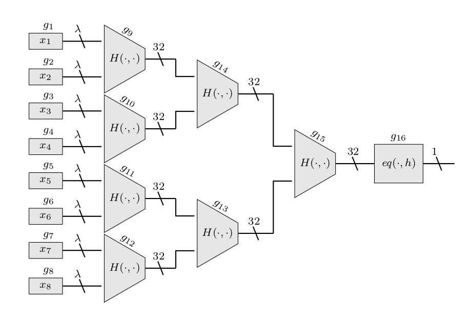

# Fairswap-Implementation

**Fair swap Implementation**

Running the file:
1. Put the solidity contract file "inicontract.sol" in a directory.
2. Create a directory by the name "contracts".
3. Execute the following command to get the go file for the contract.
     Command : abigen -sol inicontract.sol -pkg contracts -out "./contracts/inicontract.go"
4. Run the go file "main.go".
     Command: go run main.go

Each function used is put in a separate go file and description for the function is given along with it.

**Malicious outsiders** 

If the contract address is public, then other parties can call the contract function "initializeRecieverAddress" and the intended receiver can never take part in the protocol.
So, the sender can initialize the Receiver's Address during contract deployment or there can be an entry key using only which a party can call the "initializeRecieverAddress".
The latter method is implemented here. The sender sends the entry key to a particular party(receiver) through offline using which this receiver can access the "initializeRecieverAddress" function.

**Malicious Parties** 

The parties can be malicious. So, taking it into consideration of this fact, there are 2 additional stages-finishedAndMaliciousSender,finishedAndMaliciousReciever.
If an honest party finds out the other one is malicious the party can stop executing its part of the protocol.The ether is transferred to the respective party.

**Malicious Sender :**
1. The sender doesn't reveal the correct key- As a consequence, the contract's stage goes to finishedAndMaliciousSender and the ether is transferred to the receiver.
                                                                                         Once the receiver finds out the key revealed doesn't match, the receiver stops executing his part of the protocol

2. The sender calculates a wrong output in a gate: In this case, the encodedGateOutputs from which sender calculates the merklerootforEncInput for the contract is different from the encodedGateOutputs which is sent to the receiver. The receiver compares the Merkle root of both encodedGateOutputs and if negative, stops executing the protocol. In this case, there is no transaction to the contract from the receiver. Also, here the contract's stage goes to finishedAndMaliciousSender.

**Malicious Receiver :**
1. The receiver pays less ether than the price: The contract stage goes to finishedAndMaliciousReciever and the ether is transferred to the sender.

2. The receiver provides a wrong complain: The receiver provides an invalid complain. As a result, the contract stage goes to finishedAndMaliciousSender and the sender stops the execution of the protocol. The ethers are transferred to the sender.

Running malicious party code :
1. Malicious code for different instances is put in the 'MaliciousParties' directory.
2. Put one of the code in the main directory and run the go code.

**Circuit Dependency** 
 
Fairswap entirely depends upon the circuit that is agreed between the parties.
The following circuit has been implemented.

Following are the global variables and functions that are circuit specific :

Sender
1. setCircuitTuples : In this function, tuples namely gate index, inputs to a gate and the operation are initialized.
2. Encode: This function calculates the gate output and encrypts the output.

Receiver
 
 
1.Extract: The function decrypts the encoded gate Outputs got from the receiver. The complaint is generated if the sender has given an invalid gate output.
 2.Operation: Workflow for each operation is coded in this function.

Global Variables
1. noOfInputGates=8 //total number of input gates
2. maxLinesToGate=2            //maximum number of inputs a gate can take
3. totalNumberOfGates=16  //total number of gates in the entire circuit
4. const totNumOfEncOutVecToMer=16 //total number of encrypted gate outputs(equals totalNumberOfGates)

To implement a circuit of your own, appropriate changes can be made in these functions.

**Hash Function** 
Keccak256(Keccak256 in go and keccak256 in solidity) hash function is used. Since the solidity has an inbuilt keccak256 function it is preferred to use that and have Keccak256 for golang. Any other hash functions can also be used in place of keccak256.
hashFunctionOutputBitSize is the hash function output size in bytes. This global constant must be changed when using other hash function of different output byte size. All other function parameters are taken care of accordingly.

**The Contract**
 The judge contract(inicontract.sol) is written in solidity to act as a judge for the two parties.
